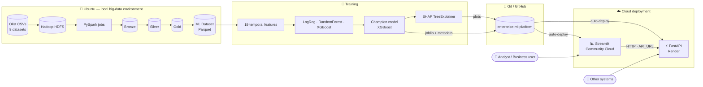
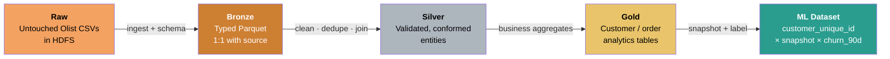
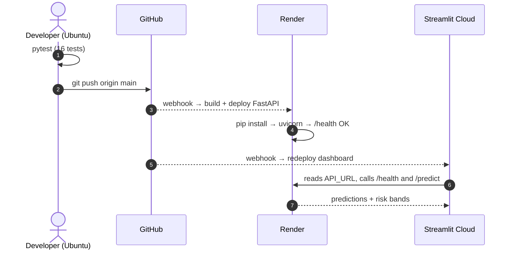
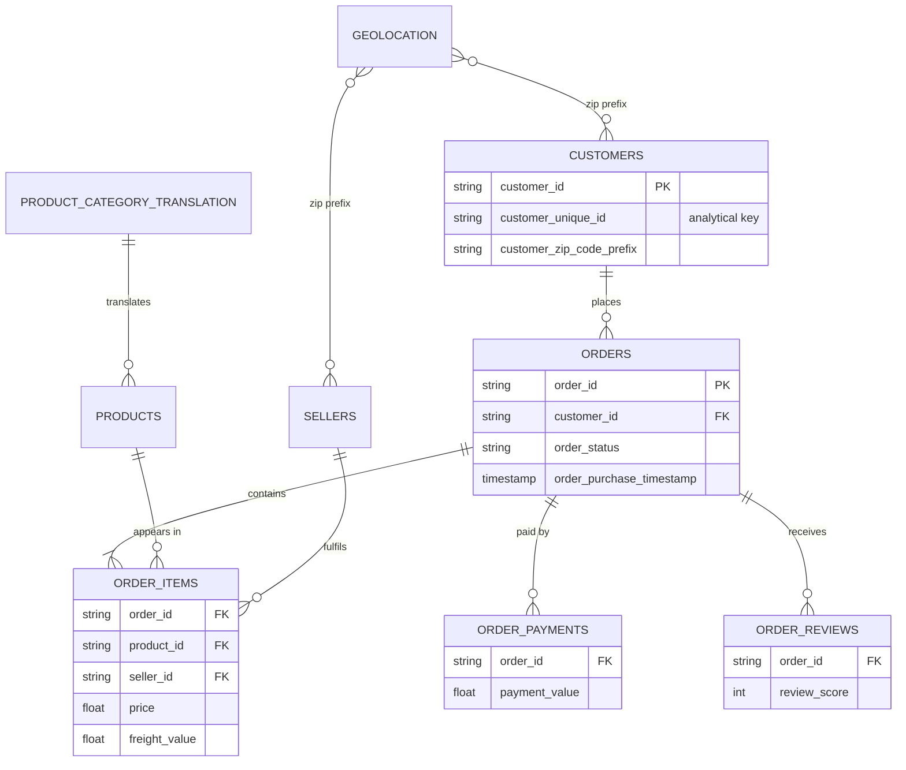
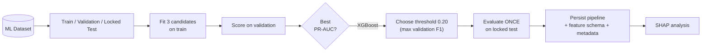
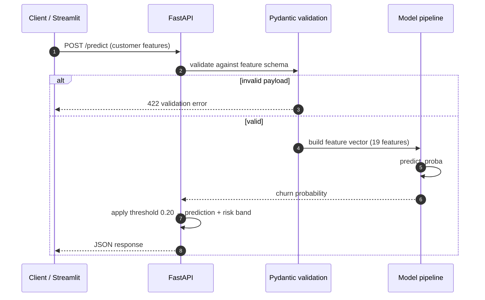
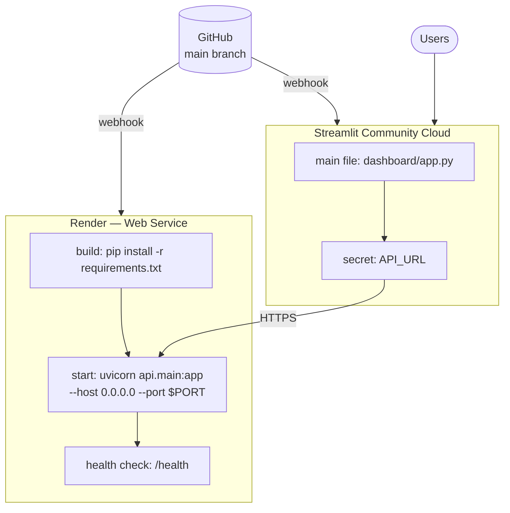
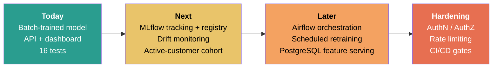

<div align="center">

# 🛒 Enterprise ML Platform
### Distributed Churn Intelligence & Model Monitoring

**Ubuntu · Hadoop HDFS · PySpark · XGBoost · SHAP · FastAPI (Render) · Streamlit**

[](https://www.python.org/)
[](https://ubuntu.com/)
[](https://hadoop.apache.org/)
[](https://spark.apache.org/)
[](https://xgboost.readthedocs.io/)
[](https://shap.readthedocs.io/)
[](https://fastapi.tiangolo.com/)
[](https://render.com/)
[](https://streamlit.io/)
[](#-testing)
[](https://github.com/Harshithpatali/enterprise-ml-platform)

*A production-style, end-to-end ML platform: raw e-commerce data flows through HDFS and PySpark
Bronze/Silver/Gold layers into a temporal customer-level dataset, then into an XGBoost prediction
service and a Streamlit MLOps dashboard.*

<!--
LIVE LINKS — uncomment and fill in once you have your URLs:
[🌐 Dashboard (Streamlit)](https://YOUR-APP.streamlit.app) · [⚡ API Docs (Render)](https://YOUR-SERVICE.onrender.com/docs)
-->

</div>

---

## 📑 Table of Contents

1. [Highlights](#-highlights)
2. [System Architecture](#-system-architecture)
3. [How I Built It — Ubuntu → Hadoop → PySpark → Git → Render → Streamlit](#-how-i-built-it)
4. [Business Problem](#-business-problem)
5. [Data & Data Engineering](#-data--data-engineering)
6. [Feature Engineering](#-feature-engineering)
7. [Model Development](#-model-development)
8. [Modeling Audit (Read This Before Trusting the Metrics)](#-modeling-audit)
9. [SHAP Explainability](#-shap-explainability)
10. [FastAPI Service](#-fastapi-service)
11. [Streamlit Dashboard](#-streamlit-dashboard)
12. [Testing](#-testing)
13. [Project Structure](#-project-structure)
14. [Local Setup](#-local-setup)
15. [Deployment (Render + Streamlit Cloud)](#-deployment)
16. [Troubleshooting](#-troubleshooting)
17. [Production-Oriented Practices](#-production-oriented-practices)
18. [Roadmap](#-roadmap)
19. [Tech Stack](#-tech-stack)
20. [Author & Disclaimer](#-author)

---

## ✨ Highlights

| | |
|---|---|
| 🗄️ **Distributed data layer** | Olist CSVs stored in **Hadoop HDFS** on Ubuntu, processed with **PySpark** into Bronze → Silver → Gold → ML dataset |
| ⏱️ **Leakage-aware target** | 180-day look-back features, 90-day forward churn label, explicit snapshot date |
| 🤖 **Model selection** | Logistic Regression vs Random Forest vs **XGBoost**, chosen by validation **PR-AUC** |
| 🔍 **Explainability** | **SHAP TreeExplainer** with global importance and per-customer drivers |
| ⚡ **Serving** | **FastAPI** on **Render**: single, batch (CSV) and health endpoints |
| 📊 **MLOps UI** | 5-page **Streamlit** dashboard on Streamlit Community Cloud |
| ✅ **Quality** | 16 automated tests, feature-schema validation, documented limitations |

<div align="center">


</div>

---

## 🏗️ System Architecture



### Data-layer flow (Medallion architecture)



---

## 🧭 How I Built It

This project was built as a full stack journey on **Ubuntu**, from a bare machine to two live cloud services.

```mermaid
flowchart LR
    S1["1️⃣ Ubuntu<br/>+ Java + SSH"] --> S2["2️⃣ Hadoop<br/>HDFS (pseudo-distributed)"]
    S2 --> S3["3️⃣ PySpark<br/>Bronze/Silver/Gold"]
    S3 --> S4["4️⃣ ML<br/>XGBoost + SHAP"]
    S4 --> S5["5️⃣ FastAPI<br/>+ pytest"]
    S5 --> S6["6️⃣ Git / GitHub"]
    S6 --> S7["7️⃣ Render<br/>API deploy"]
    S7 --> S8["8️⃣ Streamlit Cloud<br/>Dashboard deploy"]

    style S1 fill:#E95420,color:#fff
    style S2 fill:#66CCFF,color:#000
    style S3 fill:#E25A1C,color:#fff
    style S4 fill:#189AB4,color:#fff
    style S5 fill:#009688,color:#fff
    style S6 fill:#F05032,color:#fff
    style S7 fill:#46E3B7,color:#000
    style S8 fill:#FF4B4B,color:#fff
```



> The commands below are a reproducible reference. Adjust versions and HDFS paths to match your machine
> and the values used in `spark_jobs/`.

<details>
<summary><b>1️⃣ Ubuntu — Java, SSH and workspace</b></summary>

Hadoop and Spark both run on the JVM, and Hadoop's start scripts use SSH even on a single node.

```bash
sudo apt update && sudo apt install -y openjdk-11-jdk ssh pdsh python3-venv git
java -version

# passwordless SSH to localhost (required by start-dfs.sh)
ssh-keygen -t rsa -P '' -f ~/.ssh/id_rsa
cat ~/.ssh/id_rsa.pub >> ~/.ssh/authorized_keys
chmod 0600 ~/.ssh/authorized_keys
sudo service ssh start
ssh localhost exit && echo "SSH OK"
```

</details>

<details>
<summary><b>2️⃣ Hadoop HDFS — pseudo-distributed single node</b></summary>

```bash
# download and unpack (example version — use the one you installed)
wget https://archive.apache.org/dist/hadoop/common/hadoop-3.3.6/hadoop-3.3.6.tar.gz
tar -xzf hadoop-3.3.6.tar.gz && mv hadoop-3.3.6 ~/hadoop

# ~/.bashrc
export JAVA_HOME=/usr/lib/jvm/java-11-openjdk-amd64
export HADOOP_HOME=$HOME/hadoop
export PATH=$PATH:$HADOOP_HOME/bin:$HADOOP_HOME/sbin
```

`$HADOOP_HOME/etc/hadoop/core-site.xml`

```xml
<configuration>
  <property><name>fs.defaultFS</name><value>hdfs://localhost:9000</value></property>
</configuration>
```

`$HADOOP_HOME/etc/hadoop/hdfs-site.xml`

```xml
<configuration>
  <property><name>dfs.replication</name><value>1</value></property>
</configuration>
```

Format, start and load the data:

```bash
hdfs namenode -format          # first time only
start-dfs.sh
jps                            # expect NameNode, DataNode, SecondaryNameNode

hdfs dfs -mkdir -p /olist/raw
hdfs dfs -put ./data/*.csv /olist/raw/
hdfs dfs -ls /olist/raw
```

NameNode web UI: <http://localhost:9870>

</details>

<details>
<summary><b>3️⃣ PySpark — Bronze / Silver / Gold</b></summary>

```bash
python -m venv .venv && source .venv/bin/activate
pip install -r requirements-spark.txt
```

Typical shape of a job (illustrative):

```python
from pyspark.sql import SparkSession

spark = SparkSession.builder.appName("olist-bronze").getOrCreate()

orders = spark.read.csv("hdfs://localhost:9000/olist/raw/olist_orders_dataset.csv",
                        header=True, inferSchema=True)

orders.write.mode("overwrite").parquet("hdfs://localhost:9000/olist/bronze/orders")
```

Run a job:

```bash
spark-submit spark_jobs/<job_name>.py
```

</details>

<details>
<summary><b>4️⃣–5️⃣ Model training, FastAPI and tests</b></summary>

```bash
pip install -r requirements-dev.txt
python -m pytest -q tests/           # 16 passed
uvicorn api.main:app --reload        # http://localhost:8000/docs
streamlit run dashboard/app.py       # http://localhost:8501
```

</details>

<details>
<summary><b>6️⃣ Git & GitHub — version control</b></summary>

```bash
git init
git branch -M main
git remote add origin https://github.com/Harshithpatali/enterprise-ml-platform.git
```

Recommended `.gitignore` entries so raw data and Spark scratch files never reach the repo:

```gitignore
.venv/
__pycache__/
.pytest_cache/
data/
*.parquet
spark-warehouse/
metastore_db/
derby.log
```

```bash
git add .
git commit -m "feat: end-to-end churn platform"
git push -u origin main
```

The `models/` folder (model, feature schema, metadata, SHAP plots) is committed so that
Render can load the model at startup.

</details>

<details>
<summary><b>7️⃣ Render — deploy the FastAPI service</b></summary>

1. Render dashboard → **New → Web Service** → connect the GitHub repo.
2. Configure:

| Setting | Value |
|---|---|
| Runtime | Python 3 |
| Build command | `pip install -r requirements.txt` |
| Start command | `uvicorn api.main:app --host 0.0.0.0 --port $PORT` |
| Health check path | `/health` |

3. Push to `main` and Render redeploys automatically.
4. Verify: `https://<your-service>.onrender.com/health` and `/docs`.

> On Render's free tier a service spins down after inactivity, so the first request afterwards can take a while (cold start).

</details>

<details>
<summary><b>8️⃣ Streamlit Community Cloud — deploy the dashboard</b></summary>

1. <https://share.streamlit.io> → **New app** → select the repo, branch `main`.
2. **Main file path:** `dashboard/app.py`
3. **Advanced settings → Secrets:**

```toml
API_URL = "https://<your-service>.onrender.com"
```

The dashboard reads it with:

```python
import os
API_URL = os.getenv("API_URL", "http://localhost:8000")
```

</details>

### Deployment flow



---

## 🎯 Business Problem

> **Predict whether a customer will make no completed purchase during the next 90 days.**

| Item | Definition |
|---|---|
| Observation window | previous **180 days** |
| Prediction horizon | next **90 days** |
| Analytical key | `customer_unique_id` |
| Target | `churn_90d` |
| Model selection metric | validation **PR-AUC** |
| Decision threshold | **0.20**, selected on validation F1 |

<div align="center">


</div>

Because every feature is computed from data at or before the snapshot date `T`, and the label only
looks at `(T, T+90]`, no future information can leak into the model.

---

## 🗄️ Data & Data Engineering

Source: the public **Olist Brazilian E-Commerce** dataset (customers, orders, order items, payments,
reviews, products, sellers, geolocation, category translation).



| Layer | Storage | Responsibility |
|---|---|---|
| **Raw** | HDFS | Source CSVs exactly as received |
| **Bronze** | HDFS · Parquet | Schema applied, one-to-one with source |
| **Silver** | HDFS · Parquet | Cleaned, deduplicated, conformed entities |
| **Gold** | HDFS · Parquet | Business-level customer / order aggregates |
| **ML Dataset** | Parquet | One row per customer snapshot with 19 features + `churn_90d` |

> `customer_id` is generated per order in Olist, so the pipeline uses **`customer_unique_id`** to follow a real person across orders.

---

## 🧱 Feature Engineering

The deployed V2 model uses **19 temporal customer features** computed over the 180-day window.
Exact column names live in [`models/feature_names.json`](models/feature_names.json).

| Group | Features |
|---|---|
| 🛍️ Order activity | `order_count_180d`, orders per month |
| 💰 Monetary | `revenue_180d`, `payment_value_180d`, average order value, revenue per month |
| 🧺 Basket | `item_count_180d`, unique products, unique categories, unique sellers |
| ⭐ Reviews | review metrics incl. `avg_review_score_180d` |
| 🚚 Delivery | delivery-time metrics |
| ⏳ Recency & tenure | `recency_days`, `customer_lifetime_days` |

---

## 🤖 Model Development

V2 compares three model families and picks the champion on **validation PR-AUC**.

<div align="center">


</div>

| Model | Validation PR-AUC | Validation ROC-AUC |
|---|---:|---:|
| Logistic Regression | 0.989005 | 0.881206 |
| Random Forest | 0.992064 | 0.904257 |
| **XGBoost** ✅ | **0.992599** | **0.906689** |

### 🔒 Locked test performance (threshold 0.20)

| Metric | Test |
|---|---:|
| PR-AUC | 0.991381 |
| ROC-AUC | 0.879110 |
| Precision | 0.988654 |
| Recall | 1.000000 |
| F1 | 0.994295 |

<div align="center">


</div>



---

## 🔬 Modeling Audit

The V2 structural audit found a **highly imbalanced population dominated by customers with a single recent purchase**.

| Audit fact | Value |
|---|---:|
| Customer-snapshot rows | 95,194 |
| Unique customers | 93,358 |
| Churn observations | 91,452 |
| Retained observations | 3,742 |
| Overall churn rate | ≈ 96.1% |
| Strongest feature | `order_count_180d` |

<div align="center">


</div>

**How to read the metrics honestly**

- The right-hand chart is derived directly from the locked-test confusion matrix: a trivial *"always predict churn"* rule already
  reaches ≈ 0.963 precision and ≈ 0.981 F1 on this population. The model improves on that, but the headroom is small.
- The model's real added value is on the minority class: it correctly identifies **≈ 69.8%** of retained customers
  (520 of 745) while keeping recall on churners at 100%.
- Therefore the high PR-AUC / F1 must **not** be read as proof that the model predicts churn well
  among an already-active repeat-customer population.
- The model is temporally constructed and leakage-audited, but population structure limits how broadly the metrics generalize.
- **Next iteration:** evaluate an explicitly *active-customer cohort* (see [Roadmap](#-roadmap)).

---

## 🔍 SHAP Explainability

`shap.TreeExplainer` is applied to the trained XGBoost model.

<div align="center">


</div>

| Feature | Mean \|SHAP\| | Share |
|---|---:|---:|
| `order_count_180d` | 0.782484 | 42.38% |
| `payment_value_180d` | 0.332385 | 18.00% |
| `item_count_180d` | 0.217530 | 11.78% |
| `recency_days` | 0.087093 | 4.72% |
| `avg_review_score_180d` | 0.071867 | 3.89% |

The top five features explain roughly **81%** of total attribution, and the top three (order count, payment value,
item count) alone explain about **72%**. This matches the audit: the model is driven mainly by *how much
the customer has recently bought*.

The dashboard exposes global importance, saved SHAP visualizations, top drivers and high-risk customer examples.

---

## ⚡ FastAPI Service

| Method | Endpoint | Purpose |
|---|---|---|
| `GET` | `/health` | Service and model status |
| `POST` | `/predict` | Single-customer prediction |
| `POST` | `/predict/batch` | CSV batch scoring with downloadable results |
| `GET` | `/docs` | Swagger UI |

Each prediction returns the **churn probability**, **binary prediction**, **risk band** and the **threshold** used.



Example (see `/docs` for the exact request schema):

```bash
curl -X POST "https://<your-service>.onrender.com/predict" \
     -H "Content-Type: application/json" \
     -d @sample_customer.json

curl "https://<your-service>.onrender.com/health"
```

---

## 📊 Streamlit Dashboard

| # | Page | What it shows |
|---|---|---|
| 1 | **Executive Overview** | Headline metrics and model summary |
| 2 | **Customer Risk** | Score a single customer with risk band |
| 3 | **Batch Prediction** | Upload CSV → scored file to download |
| 4 | **SHAP Explainability** | Global importance, top drivers, high-risk examples |
| 5 | **Model Monitoring** | Current coverage and documented limitations |

> ⚠️ Continuous automated production **drift detection is not implemented yet**. The monitoring page documents current
> coverage and limitations rather than pretending otherwise.

<!--
SCREENSHOTS — save your screenshots in docs/images/ and uncomment:

| Executive Overview | Customer Risk |
|---|---|
|  |  |

| Batch Prediction | SHAP Explainability |
|---|---|
|  |  |
-->

---

## ✅ Testing

**16 tests** cover prediction logic and API behaviour.

```text
16 passed
1 warning
```

```bash
python -m pytest -q tests/
```

- The single warning is a **Starlette/AnyIO deprecation warning**, not a test failure.
- Spark/HDFS helper scripts are tested separately because they require a running HDFS environment.

---

## 🗂️ Project Structure

```text
enterprise-ml-platform/
├── api/                      # FastAPI application
├── dashboard/
│   ├── app.py                # Streamlit entry point
│   └── pages/                # Multi-page dashboard
├── models/
│   ├── champion_model.joblib # Persisted preprocessing + XGBoost pipeline
│   ├── feature_names.json    # Feature schema (19 features)
│   ├── model_metadata.json   # Metrics, threshold, versions
│   └── shap/                 # Saved SHAP visualizations
├── spark_jobs/               # PySpark Bronze/Silver/Gold jobs (need HDFS)
├── src/                      # Shared prediction / feature logic
├── training/                 # Model training & evaluation
├── tests/                    # 16 pytest tests
├── docs/images/              # README graphics
├── requirements.txt          # Runtime (API + dashboard)
├── requirements-spark.txt    # Spark / Hadoop jobs
├── requirements-dev.txt      # Development & testing
└── pytest.ini
```

---

## 💻 Local Setup

```bash
git clone https://github.com/Harshithpatali/enterprise-ml-platform.git
cd enterprise-ml-platform
python -m venv .venv
source .venv/bin/activate
pip install -r requirements.txt
```

| Need | Command |
|---|---|
| Development / tests | `pip install -r requirements-dev.txt` |
| Spark / Hadoop jobs | `pip install -r requirements-spark.txt` |

Run the API:

```bash
uvicorn api.main:app --reload
```

Run the dashboard in a second terminal:

```bash
streamlit run dashboard/app.py
```

| Service | URL |
|---|---|
| API | <http://localhost:8000> |
| Swagger UI | <http://localhost:8000/docs> |
| Dashboard | <http://localhost:8501> |

---

## 🚀 Deployment



| Component | Platform | Key configuration |
|---|---|---|
| FastAPI | **Render** | Start: `uvicorn api.main:app --host 0.0.0.0 --port $PORT` · Health: `/health` |
| Dashboard | **Streamlit Community Cloud** | Main file: `dashboard/app.py` · Secret: `API_URL` |

The dashboard must **not** hard-code `localhost`:

```python
import os
API_URL = os.getenv("API_URL", "http://localhost:8000")
```

---

## 🛠️ Troubleshooting

| Symptom | Likely cause | Fix |
|---|---|---|
| `Connection refused` on `localhost:9000` | NameNode not running | `start-dfs.sh`, then check `jps` |
| `start-dfs.sh` asks for a password / fails on SSH | No passwordless SSH to localhost | Redo the SSH key steps, `sudo service ssh start` |
| `JAVA_HOME is not set` | Environment variable missing | Export it in `~/.bashrc`, then `source ~/.bashrc` |
| Spark can't read `hdfs://…` paths | Wrong host/port or HDFS down | Match `fs.defaultFS` in `core-site.xml` |
| Render deploy fails to bind | Not using `$PORT` | Use `--host 0.0.0.0 --port $PORT` in the start command |
| First API call after idle is very slow | Free-tier cold start | Wait, or use a paid instance |
| Dashboard says API unreachable | `API_URL` missing or wrong | Set the Streamlit secret to the Render URL (no trailing path) |
| `pytest` can't import modules | Wrong working directory | Run from the repo root (`pytest.ini` lives there) |

---

## 🏭 Production-Oriented Practices

- ✅ Temporal feature construction with an explicit prediction horizon
- ✅ Validation-based model selection and a **locked** test evaluation
- ✅ Persisted preprocessing + model pipeline
- ✅ Feature schema validation
- ✅ Batch inference
- ✅ API health endpoint
- ✅ SHAP explainability
- ✅ Automated unit and API tests
- ✅ Separate runtime and Spark dependencies
- ✅ Git-based versioning
- ✅ Documented modeling limitations

---

## 🗺️ Roadmap



- [ ] MLflow experiment tracking and model registry
- [ ] Automated data / model drift monitoring
- [ ] Scheduled retraining
- [ ] Data quality contracts
- [ ] Airflow orchestration
- [ ] PostgreSQL feature serving
- [ ] Authentication and authorization
- [ ] API rate limiting
- [ ] CI/CD deployment gates
- [ ] Model calibration monitoring
- [ ] Active-customer cohort modeling

---

## 🧰 Tech Stack

| Layer | Tools |
|---|---|
| **OS / Environment** | Ubuntu, OpenJDK, SSH |
| **Data Engineering** | Python, Hadoop HDFS, PySpark, Parquet |
| **Machine Learning** | scikit-learn, XGBoost, SHAP, Pandas, NumPy |
| **Serving** | FastAPI, Uvicorn, Pydantic |
| **Analytics / UI** | Streamlit, Plotly |
| **Deployment** | Render (API), Streamlit Community Cloud (dashboard) |
| **Engineering** | Pytest, Git, GitHub |

---

## 👤 Author

**Harshith Devaraja**

Machine Learning / Data Science portfolio project focused on production-oriented ML systems,
analytics, experimentation, and applied machine learning.

Repository: <https://github.com/Harshithpatali/enterprise-ml-platform>

---

## ⚠️ Disclaimer

This is a portfolio / engineering project based on the public **Olist Brazilian E-Commerce** dataset.
Model metrics are dataset-specific and should not be interpreted as production performance without
validation on representative business data.
